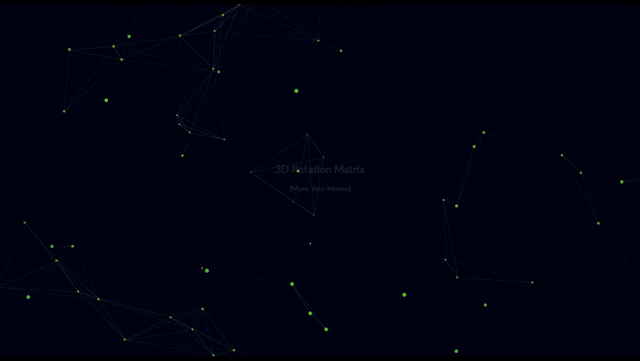

# JS-Rotation-Matrix

 Matrix of dots connected to each other, rotate around the window.  
    When onmousemove is called, the canvas reacts.  
    Speed and color can be modified.

Updated: March 8, 2021 

